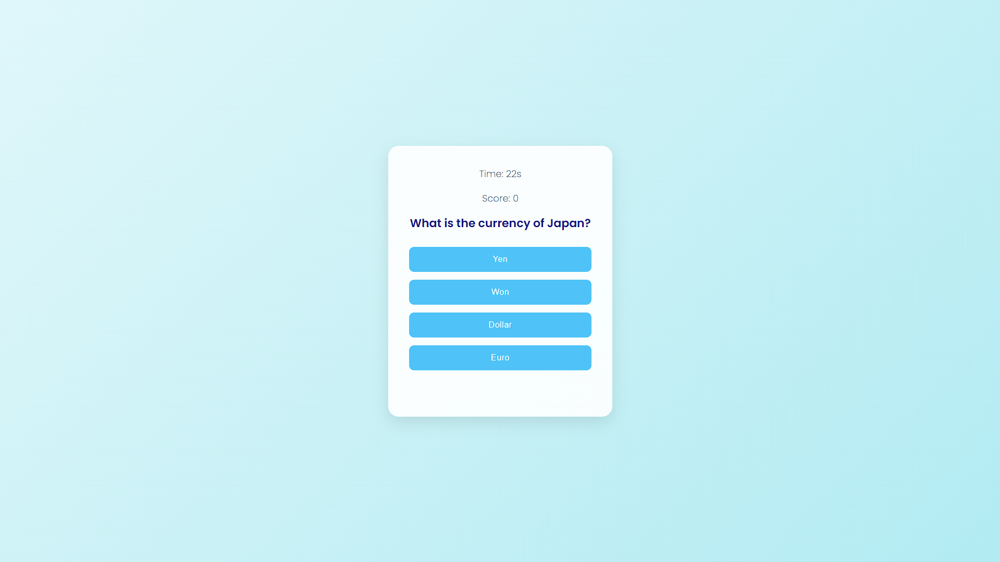

# Quiz Application

## Overview
This is a simple quiz application built with HTML, CSS, and JavaScript. The quiz consists of multiple-choice questions on various topics, allowing users to test their knowledge and track their scores. At the end of the quiz, users will see their score along with the correct answers.

## Features
- Multiple-choice questions
- Score tracking
- Timer countdown
- Immediate feedback on answers
- Display of correct answers at the end

## Technologies Used
- HTML
- CSS
- JavaScript

## Demo


## Getting Started

### Prerequisites
- A modern web browser (e.g., Chrome, Firefox, Safari)

### Installation
1. Clone the repository:
   ```bash
   git clone https://github.com/Pradyut-Guchhait/Interactive-Quiz-Website.git
